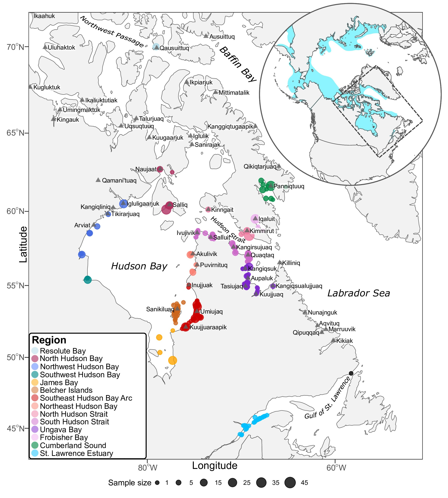
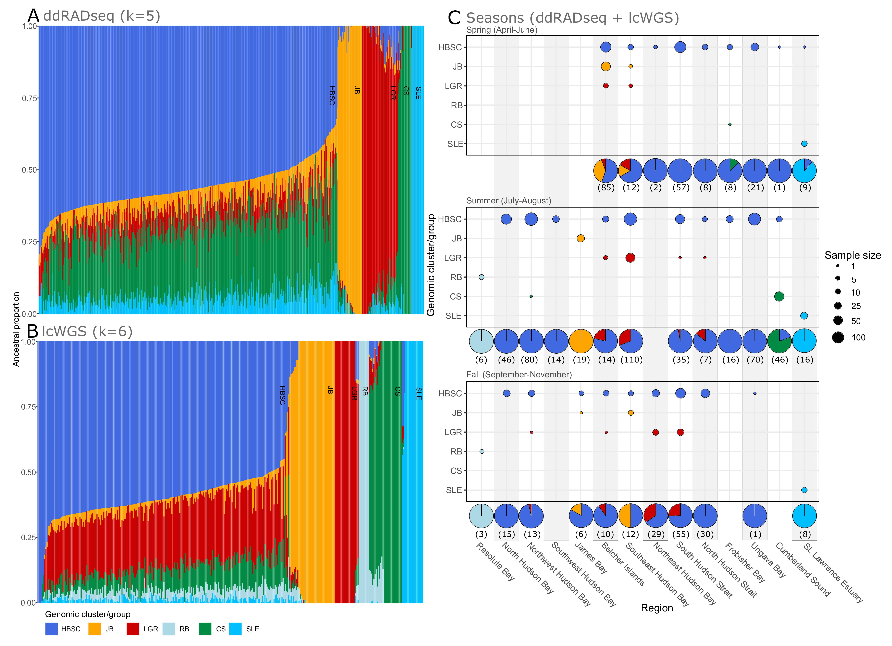
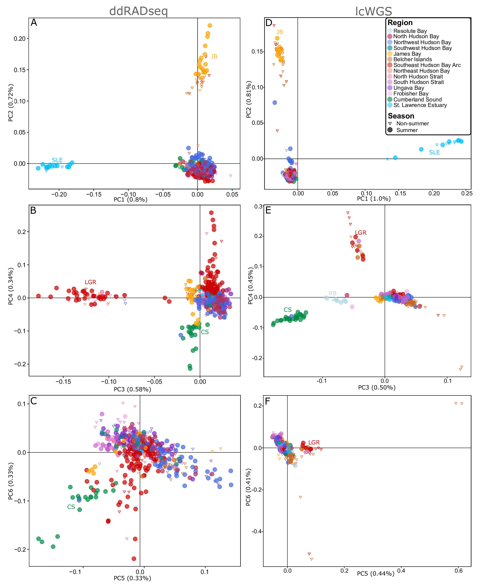
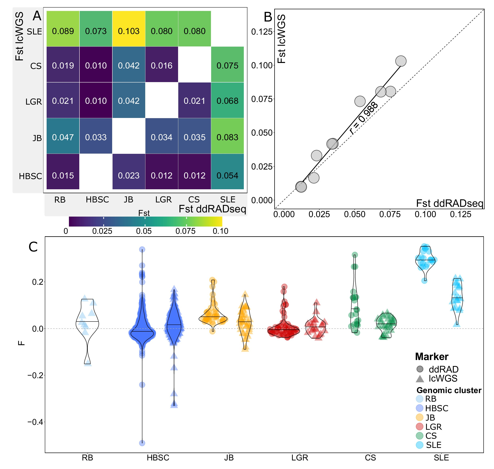
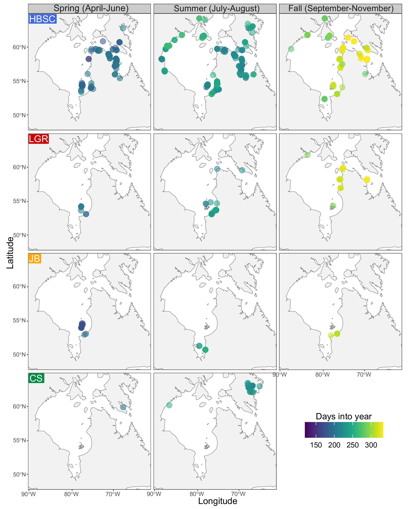

# R scripts, figures and results for MS:
## Reduced representation and whole-genome sequencing approaches highlight beluga whale populations associated to eastern Canada summer aggregations
### Pt. II: SNP filtering and population genomic analyses using ddRAD SNPs

__Main authors:__  Luca Montana and Audrey Bourret  
__Affiliation:__  Fisheries and Oceans Canada (DFO)   
__Group:__        Laboratory of genomics   
__Location:__     Maurice Lamontagne Institute  
__Affiliated publication:__ Montana L, Bringloe TT, Bourret A, Sauvé C, Mosnier A, Ferguson SH, Postma L, Lesage V, Watt CA, Hammill MO, Parent GJ (under review). Reduced representation and whole-genome sequencing approaches highlight beluga whale populations associated to eastern Canada summer aggregations. Evolutionary Applications
__Contact:__      e-mail: luca.montana@usherbrooke.ca

- [Objective](#objective)
- [Summary](#summary)
- [Status](#status)
- [Contents](#contents)
- [Manuscript main figures](#manuscript-main-figures)
- [Requirements](#requirements)
- [Acknowledgements](#acknowledgements)

## Objective

Effective conservation strategies inherently depend on preserving populations, which in turn requires accurate tools for their detection. Beluga whales (*Delphinapterus leucas*) inhabit the circumpolar Arctic and form discrete summer aggregations. Previous genetic studies using mitochondrial and microsatellite loci have delineated distinct populations associated to summer aggregations but the extent of dispersal and interbreeding among these populations remains largely unknown. Such information is essential for the conservation of populations in Canada as some are endangered and harvested for subsistence by Inuit communities. Here, we used reduced representation and whole-genome sequencing approaches to characterize population structure of beluga whales in eastern Canada and examine admixture between populations. A total of 905 beluga whales sampled between 1989 and 2021 were genotyped. Six main genomic clusters, with potential subclusters, were identified using multiple proxies for population structure. Most of the six main genomic clusters were consistent with previously identified populations, except in southeast Hudson Bay where two clusters were identified. Beluga summer aggregations may consequently be comprised of more than one distinct population. A low number of dispersers were identified between summer aggregations and limited interbreeding was detected between the six genomic clusters. Our work highlights the value of genomics approaches to improve our understanding of population structure and reproductive behavior in beluga whales, offering insights applicable to other cetacean species of conservation concern. An expansion of the geographical scope and increase in number of genotyped individuals will, however, be needed to improve the characterization of the finer scale structure and of the extent of admixture between populations.

The scripts, dataset and results relative to this publication are divided in two GitHub repositories:
1) MOBELS_PopStructure_ddRAD_MS_SNPdiscovery - for loci and SNP detection for ddRAD reads using the Stacks 2 pipeline
2) MOBELS_PopStructure_ddRAD_MS_PopGenAnalyses - filtering and population genomic analyses (THIS REPOSITORY)

## Status
Completed

## Contents
### Folder structure

    .
    ├── OO_Data     # Folder containing data used for the analyses 
    ├── 01_Code     # R scripts  
    ├── 02_Results  # Main results      
    └── README.md

### Main scripts

[**01_Filter_SNPs_Bringloe22xii22_5X_20230418.R**](01_Scripts/01_Filter_SNPs_Bringloe22xii22_5X_20230418.R) Multiple SNP filtering steps to obtain the full SNP panel for analyses.

[**02_Dataprep.R**](01_Scripts/02_Dataprep.R) Metadata formatting. 

[**03_ddRAD_PopGen_ALL_20230614_ms.R**](01_Scripts/03_ddRAD_PopGen_ALL_20230614_ms.R) All analysis (PCA, Admixture, Fst, Heterozigosity) for the full SNP panel.

[**04a_OutlierDetection.R**](01_Scripts/04a_OutlierDetection.R) Detection of outlier SNPs from the full SNP panel.

[**04b_ddRAD_neutral_PopGen_ALL_20240207_ms.R**](01_Scripts/04b_ddRAD_neutral_PopGen_ALL_20240207_ms.R) All analysis (PCA, Admixture, Fst, Heterozigosity) for the SNP panel without outlier SNPs.

## Manuscript main figures

|  |
|:--:| 
| **Figure 1** Distribution of eastern Canada beluga whales (1989-2021) genotyped using (A) ddRADseq (N = 638) and (B) lcWGS (N = 340) approaches. The circular insert depicts the global range of beluga whales (adapted from Hobbs et al. 2019), and a dashed rectangle outlining the study area. Note, only lcWGS data was produced for Resolute Bay individuals (see Table 1). A single individual is plotted in the Gulf of St. Lawrence (black dot), which is not assigned to a region. |

|  |
|:--:| 
| **Figure 2** Ancestral proportions obtained with ADMIXTURE for beluga whales from eastern Canada, 1989-2021. Panels A and B represent ADMIXTURE membership probabilities for the ddRADseq (without outlier loci) and the lcWGS datasets, respectively. Colors in panels A and B represent the ancestral lineages (clusters) detected. For full results at K = 2-10 sorted by geographic location, see Figures S2-4. Panel C characterizes temporal and regional variation in the proportion of individuals from each cluster identified by ADMIXTURE, combining results from both SNPs datasets (the Population genomic analyses section in Methods describes how individuals with mixed ancestry were classified into clusters). Sample sizes are presented below each pie chart for each region and season. Since all winter samples (N = 8) were harvested in the Belcher Islands region, winter results are not shown in Panel C, but seven beluga whales were associated to the JB cluster and one to the HBSC one. Acronyms correspond to the following genomic clusters: HBSC = Hudson Bay-Strait Complex; JB = James Bay; LGR = Little and Great Whale Rivers; RB = Resolute Bay; CS = Cumberland Sound; SLE = St. Lawrence Estuary.  |

|  |
|:--:| 
| **Figure 3** Results from the Principal Component Analyses (PCA) of eastern Canada beluga whales using ddRADseq (without outlier loci; A, B, C) and lcWGS (D, E, F) datasets. Depicted are PC axes 1-2 (panels A, E), 3-4 (panels B, F), and 5-6 (panels C, G). Figure S5 presents percent variation explained by other PC axes. See Figure S4 for the comparison of ddRADseq PCA results with outlier loci. Colors represent sampling regions (Table 1), and acronyms correspond to the following genomic clusters: JB = James Bay; SLE = St. Lawrence Estuary; LGR = Little and Great Whale Rivers; RB = Resolute Bay; CS = Cumberland Sound. |

|  |
|:--:| 
| **Figure 4** Population statistics for beluga whale genomic clusters in eastern Canada. A) Heatmap of average FST measurements for ddRADseq (without outlier loci) and lcWGS datasets. B) Correlation of FST estimates for genomic cluster identified with the ddRADseq (without outlier loci) and the lcWGS datasets. C) Inbreeding coefficient (F) estimated with the ddRADseq (without outlier loci) and lcWGS datasets. Horizontal lines within violin distributions represent the median. Acronyms correspond to the following genomic clusters: RB = Resolute Bay, HBSC = Hudson Bay-Strait Complex, JB = James Bay, LGR = Little and Great Whale Rivers, CS = Cumberland Sound, SLE = St. Lawrence Estuary. Note, RB individuals were not genotyped with ddRADseq. |

|  |
|:--:| 
| **Figure 5** Seasonal distributions of four out of six beluga whale genomic clusters (Hudson Bay-Strait Complex – HBSC, Little and Great Whale Rivers – LGR, James Bay – JB, and Cumberland Sound – CS) identified with ddRADseq and lcWGS ADMIXTURE analyses in eastern Canada, 1989-2021. The color palette provides a finer temporal resolution of sampling day within seasons across the study area. The RB and SLE clusters are not presented since these beluga whales were not detected migrating outside their summering regions. Location of winter samples (N = 8) is also not displayed, but all originated from the Belcher Islands (Figure 2C). |

## Requirements
Raw sequence data for the *Delphinapteus leucas* ddRAD and lcWGS datasets are available in the Sequence Read Archive (SRA) under the BioProject accession PRJNA984210. 

## Acknowledgements
We are grateful to Nunavik and Nunavut Inuit hunters and stakeholders for providing beluga whale samples. We also acknowledge Denise Tenkula, Laura Benestan, Frédérique Paquin, Éric Parent, Claudie Bonnet, Justine Hudson, and Grégoire Cortial for preparing samples for genomic sequencing. This project was funded by Nunavik Inuit Land Claims Agreement (NILCA) funding and DFO Results Funds.